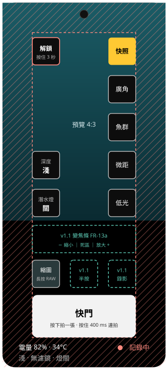

# 潛水鎖定畫面配置

2026-09-30 · 狀態：草案（維護者 2026-09-28 確認配置；FR-55 邊界與可按範圍在 G3 泳池量測後定稿；2026-09-30 定位為操作邏輯的測試版，外觀之後持續改進，見[需求第 9 節](requirements/09-open-items.md)）

M3 的畫面設計，對應 [mvp-scope.md](mvp-scope.md) 2.4 節的「潛水鎖定畫面配置圖」。範圍是 FR-12、FR-24、FR-51、FR-52、FR-55、FR-56、FR-62 的縮圖，以及 2.2 節的深度段與潛水燈切換鍵；FR-13a、FR-15a 寫明「版面在 M3 另行規劃」，所以 FR-13 錄影鍵一併保留位置（v1.1）。

## 1. 螢幕尺寸

| 項目 | 值 | 說明 |
| --- | --- | --- |
| 解析度、像素密度 | 1280 × 2856 px，495 ppi | 公開規格：[Google Store](https://store.google.com/product/pixel_10_pro_specs?hl=en-US)、[devicespecifications.com](https://www.devicespecifications.com/en/model-display/b0ab6463)。取自搜尋結果摘要，未直接開頁核對 |
| 顯示區 | 65.68 × 146.55 mm | px ÷ ppi 的矩形近似，未扣圓角與挖孔；對角 6.32 吋，與公開的 6.3 吋一致 |
| dp 換算 | 1 mm ≈ 6.30 dp | 推測：160 dp/吋名目值。實際依系統「顯示大小」設定，實機以 `adb shell wm size`、`wm density` 核對；程式依 FR-55 在執行時以 xdpi / ydpi 換算 mm |
| 可點範圍 | x 12–53.68、y 12–134.55 mm | 四邊各扣 12 mm 安全區（FR-55） |

方向固定為直向：FR-13a 變焦條在「取景畫面下方」、FR-52 快門在短邊、FR-92 倒拿時鏡頭朝下且快門仍在拇指側，三者在直向下成立。

## 2. 畫面狀態

| 狀態 | 進入方式 | 行為 |
| --- | --- | --- |
| 一般模式 | 啟動 APP；解鎖後 | 完整拍攝畫面（04-scenarios「下水前」需要一般相機行為）；可進設定頁；系統列照常；不蓋在系統鎖定畫面上 |
| 設定頁 | 一般模式按「設定」 | v1.0 只有 FR-24 已裝濾鏡（無 / 紅 / 洋紅）；鎖定中不能進入 |
| 等待固定確認 | 一般模式按「潛水鎖定」 | 呼叫 `startLockTask()`，系統對話框按「知道了」後才鎖定，取消則留在一般模式（[g1-dive-lock-platform.md](../test/g1-dive-lock-platform.md) 第 1 項） |
| 潛水鎖定 | 固定確認後；崩潰重啟後 | ADR-0006 全部機制；FR-56 蓋在系統鎖定畫面上；FR-45 記錄中；設定鍵隱藏 |
| 解鎖中 | 鎖定中按住「解鎖」 | 顯示 3 s 進度，未滿 3 s 放開即取消；滿 3 s 呼叫 `stopLockTask()`、結束 FR-45、回一般模式。解除固定後手機隨即上鎖（g1 第 6 項），使用者解開手機後才看到一般模式 |

崩潰重啟（NFR-1）直接回到潛水鎖定，不經一般模式；FR-45 延續同一個場次（維護者 2026-09-28 決定，[ADR-0008](../adr/0008-depth-telemetry.md) 補註）。因此「是否在鎖定中」與目前場次 ID 要存在程序外，重啟後讀回。

## 3. 元件

座標為左上角，單位 mm，原點在螢幕左上；由 `:app` 的 `layout/DiveLockLayout` 依螢幕尺寸計算，下表是 Pixel 10 Pro 的值（小數兩位）。按鍵一律 11 × 11 mm（約 69 dp，07-housing 要求 ≥ 64 dp）。

| 元件 | 版本 | x, y | 尺寸 | 行為與依據 |
| --- | --- | --- | --- | --- |
| 預覽 | v1.0 | 0, 0 | 65.68 × 87.57 | 4:3，佔滿短邊 |
| 預設 × 5 | v1.0 | 42.68, 14 起，間距 15.27 | 11 × 11 | FR-12：右側單一長邊，單點即切換，不捲動；由上而下快照、廣角、魚群、微距、低光。疊在預覽上，用不透明底 |
| 潛水鎖定 / 解鎖 | v1.0 | 12, 14 | 11 × 11 | 一般模式單點進入鎖定；鎖定中按住 3 s 解鎖（FR-51）。離拇指最遠 |
| 設定 | v1.0 | 12, 29.27 | 11 × 11 | 只在一般模式出現（FR-24） |
| （空） | — | 12, 44.54 | — | 不預先指定用途 |
| 深度段 | v1.0 | 12, 59.81 | 11 × 11 | 單鍵循環淺 → 中 → 深（mvp-scope 2.2） |
| 潛水燈 | v1.0 | 12, 75.07 | 11 × 11 | 單鍵開 / 關（FR-25） |
| 變焦條 | v1.1 | 12, 89.57 | 41.68 × 11 | FR-13a：DV 式，中央死區，右放大、左縮小；v1.0 留白 |
| 最近一張縮圖 | v1.0 | 12, 103.57 | 11 × 11 | FR-62：拍後 10 s 內長按保留 RAW；v1.0 無 APP 內相簿，單點不動作 |
| 半按鈕 | v1.1 | 27.34, 103.57 | 11 × 11 | FR-15a；v1.0 留白 |
| 錄影鍵 | v1.1 | 42.68, 103.57 | 11 × 11 | FR-13；v1.0 留白 |
| 快門條 | v1.0 | 12, 117.57 | 41.68 × 16.98 | FR-52：短邊整條扣兩側安全區（263 × 107 dp，≥ 88 dp）；按下即拍、按住 400 ms 轉連拍 |
| 唯讀資訊 | v1.0 | 下緣 134.55–146.55 | 字高 2.7 mm | 07-housing 電量與機身溫度（溫度異常時改警示色）；深度段、濾鏡、潛水燈；鎖定中顯示 FR-45 記錄狀態 |

v1.1 保留位在 v1.0 留白，v1.1 加入時其他元件不移動（維護者 2026-09-28 決定）。一般模式與鎖定狀態的元件位置相同，只差左欄前兩格與狀態列。

## 4. 配色（NFR-5）

只用黑、白、琥珀色，狀態色不用藍色。按鍵用不透明深色底，對比不受預覽內容影響。

| 前景 / 背景 | 用途 | 對比 |
| --- | --- | --- |
| `#FFFFFF` / `#000000` | 一般文字 | 21.0 : 1 |
| `#000000` / `#FFC933` | 選中的預設 | 13.7 : 1 |
| `#B8B8B8` / `#000000` | 次要文字 | 10.6 : 1 |
| `#FF8A7F` / `#000000` | 記錄中、警示 | 9.2 : 1 |

對比依 WCAG 相對亮度公式計算，門檻 7 : 1；實作時以單元測試檢查同一組配對。

## 5. 未驗證與待定

- 推測：mm 與 dp 的換算、挖孔位置、圓角半徑。
- 按鍵固定 11 mm，實體大小不隨系統「顯示大小」改變。顯示大小調大一級時（推測每 dp 約多 15%），11 mm 只剩約 60 dp；2026-09-29 決定以實體大小為準，G1 在系統預設顯示大小下量測 dp（需求第 9 節）。
- 推測：一般模式不蓋在系統鎖定畫面上，要在執行中切換 `setShowWhenLocked`，未在實機試過。
- SeaTouch 4 殼框實際遮住的邊緣寬度，G3 量測後定稿 FR-55。
- v1.1 待決（[需求第 9 節](requirements/09-open-items.md)）：FR-93 自訂預設在選擇器中的位置、FR-32 對焦滑桿的位置、FR-13 影片方向。
