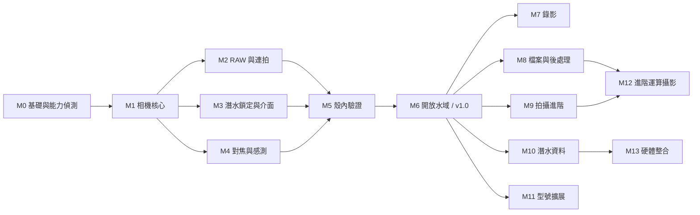

# Anomalops 開發里程碑

2026-09-28 · 版本劃分依 [需求文件](requirements/README.md) 第 9 節版本表；v1.0 的細節見 [mvp-scope.md](mvp-scope.md) 與 [mvp-acceptance.md](mvp-acceptance.md)

本文件不排日期。進度的瓶頸是潛水機會，不是開發時間：

- v1.0 至少需要 1 次 28°C 水浴、1 次泳池、3 趟開放水域。
- 每新增一個型號，至少還要 1 趟帶灰卡的校正潛水（[需求第 8 節](requirements/08-risks.md)）。

排序原則：
1. 風險高、驗證成本低的先做，例如能力偵測、平台行為探查。
2. 每趟潛水都順便收集下一階段需要的資料（第 6 節），減少專程下水的次數。

## 1. 總覽

| 版本 | 里程碑 | 主題 | 完成條件 |
| --- | --- | --- | --- |
| v1.0 | M0 | 基礎與能力偵測 | G0 通過 |
| | M1 | 相機核心 | 相關 G1 項目通過 |
| | M2 | RAW 與連拍 | 相關 G1 項目通過 |
| | M3 | 潛水鎖定與操作介面 | 相關 G1 項目通過 |
| | M4 | 對焦、感測與深度來源 | 相關 G1 項目通過 |
| | M5 | 殼內驗證 | G2、G3 通過 |
| | M6 | 開放水域校正，發布 v1.0 | G4 通過，符合 v1.0 完成定義 |
| v1.1 | M7 | 錄影 | 見 3.1 |
| | M8 | 檔案管理與後處理 | 見 3.2 |
| | M9 | 拍攝進階 | 見 3.3 |
| | M10 | 潛水資料與操作輔助 | 見 3.4 |
| v1.2 | M11 | 型號擴展 | 見第 4 節 |
| v2.0 | M12 | 進階運算攝影 | 見 5.1 |
| | M13 | 硬體整合與其他 | 見 5.2 |

M11 技術上只依賴 v1.0，可以和 v1.1 並行；版本號仍照版本表記為 v1.2。

## 2. v1.0（MVP）

### M0 基礎與能力偵測

- **已決定**：GPL-3.0-or-later、applicationId `io.github.tengigabytes.anomalops`（[授權](../release/licensing.md)）。專案骨架從一開始就建立 `play`、`foss` 兩個建置 flavor（ADR-0010）。
- **工作**
  - 依 ADR-0007 建立 Gradle 專案骨架與模組。
  - 實作 `:tools:probe` 能力偵測工具，在 Pixel 10 Pro 執行，提交能力表（ADR-0003）。
  - 提前做 ADR-0006 的平台行為探查：螢幕固定、抬頭通知、電源鍵、崩潰重啟。這部分不需要相機程式，卻是整個操作模型的前提，所以提早排除風險。
- **完成條件**
  - 能力表已提交。
  - ADR-0001、0002、0004、0005、0009 的 G0 驗證項，以及 ADR-0006 的驗證項，都已有結論。
  - 與推測不同的 ADR 已修改。

### M1 相機核心

- **範圍**
  - FR-11：依能力表定稿預設參數。
  - FR-61a、FR-81、FR-91。
  - 實作 ADR-0002 的白平衡套用與 ADR-0009 的曝光換算。
  - MediaStore 寫入。
- **注意**：這時還沒有水下校正值，校正表先放陸上日光的值，只用來驗證管線。2026-09-28 補充：維護者同意改用室內檯燈下的自動白平衡讀數（沒有灰卡，以白紙為目標），見 [m1-pipeline-calibration.md](../test/m1-pipeline-calibration.md)。
- **完成條件**：mvp-acceptance.md 中以下各列在 G1 通過：FR-11、FR-61a、FR-81、FR-91、NFR-4、NFR-7、NFR-8。

### M2 RAW 與連拍

- **範圍**：FR-15、FR-16、FR-62、FR-64、FR-68，實作 ADR-0005。
- **完成條件**：以上各列在 G1 通過。

### M3 潛水鎖定與操作介面

- **範圍**
  - FR-12、FR-51、FR-52、FR-55、FR-56。
  - 深度段切換鍵與潛水燈模式切換鍵（mvp-scope.md 2.2 節）。
  - FR-24 已裝濾鏡的設定頁（2026-09-28 併入 M3；M4 只做了切換機制）。
  - 畫面配置見 [dive-lock-layout.md](dive-lock-layout.md)。
  - NFR-5、NFR-6、NFR-10。
- **完成條件**：以上各列在 G1 通過。
- **2026-09-30 補註**：M3 畫面是操作邏輯的測試版，外觀之後持續改進（[需求第 9 節](requirements/09-open-items.md)）。NFR-5 室內與戶外目視不列入 M3，延到 UI 整理後；FR-51 鎖定 90 分鐘不熄滅與過熱警示門檻併入 G2。G1 結果見 [m3-instrumented.md](../test/m3-instrumented.md)。

### M4 對焦、感測與深度來源

- **範圍**
  - FR-21、FR-24、FR-25 的切換機制（校正值在 M6 才有）。
  - FR-31、FR-35、FR-45、FR-82、FR-84。
  - NFR-9 的建置檢查。
- **前置**：FR-82 需要一台看得到 940 nm 的相機（[需求第 9 節](requirements/09-open-items.md)）。
- **完成條件**：以上各列在 G1 通過。

### M5 殼內驗證（G2、G3）

- **28°C 水浴 90 分鐘**：NFR-1、NFR-2、NFR-3、FR-45。
- **泳池**：FR-12、FR-15、FR-51、FR-52、FR-55、FR-62、兩個切換鍵、NFR-6。
- **產出**：安全區寬度與潛水鎖定畫面配置定稿。
- **風險處理**：如果 NFR-3 耗電不達標，第一個考慮提前到 v1.0 的是 FR-57 APP 內待機，並照 mvp-scope.md 第 5 節的變更規則處理。

### M6 開放水域校正與 v1.0 發布（G4）

- **前置決定**（[需求第 9 節](requirements/09-open-items.md)）
  - 白平衡校正基準：商用灰卡或自製 PCB 白板。
  - 深度分段邊界。
  - 發行管道照第 8 節的發行軌道。
- **第 1 趟**：淺 / 中 / 深各一組灰卡校正，產生校正表並提交。
- **第 2–3 趟**：驗證 FR-21、FR-24、FR-25、FR-91、NFR-1、NFR-3、NFR-5、NFR-6；其中一趟做 30 m 觸控測試。
- **完成條件**：符合 mvp-acceptance.md 第 4 節的完成定義，發布 v1.0。

## 3. v1.1

四個里程碑之間沒有依賴，可以依需要排序。共同前置條件是 v1.0 已發布。

2026-09-30 補充（維護者決定）：不需要手機就能開發與測試的純邏輯可以提前寫，但不接上 v1.0 的程式路徑；前置條件只約束接上與驗收。見 [early-logic.md](early-logic.md)。

### 3.1 M7 錄影

- **範圍**：FR-13、FR-94。
- **前置決定**：錄影是否需要 LOG 色彩描述檔（[需求第 9 節](requirements/09-open-items.md)）。
- **完成條件**：NFR-1、NFR-2 原文中的錄影部分開始適用，包括密封殼內 1440p30 錄影 10 分鐘（2026-09-28 由 4K30 改）。

### 3.2 M8 檔案管理與後處理

- **範圍**：FR-61（10-bit HEIC）、FR-64 的無損壓縮、FR-23、FR-26、FR-65、FR-66、FR-67、FR-69、FR-70、FR-71、FR-73。
- **依賴**
  - FR-69 的驗收需要 20 組實拍連拍，來自 M6 起收集的資料（第 6 節）。
  - FR-65 重新沖洗後會重新產生成品檔，所以先做 FR-61 的格式。

### 3.3 M9 拍攝進階

- **範圍**：FR-14、FR-17、FR-17a、FR-22、FR-32、FR-33、FR-36、FR-37、FR-63、FR-92、FR-93、FR-95。
- **前置決定**：焦點堆疊與 FR-68「連拍不存 DNG」的衝突，2026-09-30 已決定：焦點堆疊每張拍 RAW（[需求第 9 節](requirements/09-open-items.md)）。
- **前置工作**
  - **最先做**：微距景深合成的陸上驗證，[macro-stacking-test-plan.md](../test/macro-stacking-test-plan.md) 的 T1、T2（望遠實體鏡頭存取、各鏡頭距離校準類型），接著 T3–T5（校正）。FR-33、FR-36 都依賴這兩項（ADR-0013、ADR-0014）。只需手機，可以在 v1.0 發布前做。
  - FR-17a 開發前，先在實機列出可用的相機擴充，以及它們接受的控制鍵。
  - 對齊程式（FR-17、FR-33 共用）先於兩者：2026-10-01 已有 CPU 版，在 `:core:imaging`（ADR-0016）；FR-33 的三個候選合成演算法、FR-17 第一階段的 CPU 參考版也已實作；FR-33 依 T12 選定（ADR-0015），FR-17 的 CPU 版在桌機就超過 3 s，正式版要走 GPU。

### 3.4 M10 潛水資料與操作輔助

- **範圍**：FR-41、FR-42、FR-44、FR-53、FR-57、FR-58、FR-83、FR-85。
- **依賴**
  - FR-83 入水偵測要先有 M5、M6 的 FR-45 氣壓資料，證實入水時確實有氣壓階躍（[需求第 8 節](requirements/08-risks.md)）。
  - FR-85 BLE 協定要先決定 BLE 模組是否自行設計（[需求第 9 節](requirements/09-open-items.md)）。

### 3.5 版本未定：FR-97 物種辨識

FR-97 標為 P1，但版本表放在 v2.0，[需求第 9 節](requirements/09-open-items.md)仍待決。不論放在哪一版，驗證用的照片集都從 M6 開始累積。

## 4. v1.2：M11 型號擴展

- **型號**：Pixel 11 Pro、9 Pro、8 Pro、7 Pro、6 Pro，依手邊能取得的實機排序。
- **每個型號的流程**
  1. 跑能力偵測工具，提交能力表。
  2. 做一趟校正潛水，提交校正值。
  3. 通過以下驗收子集：G0 全部，以及 G1、G4 中的 FR-11、FR-21、FR-51、FR-61a、FR-62、FR-91。
- **舊型號降級**：依 [需求第 8 節](requirements/08-risks.md)處理，例如 Pixel 6 Pro 沒有溫度感測器、超廣角沒有 AF，發熱門檻也要放寬。
- **完成條件**：新增型號只改動 `assets/device-profiles/`（NFR-9）。
- **潛水成本**：五個型號至少五趟校正潛水，可以和其他里程碑的驗證潛水合併進行。

## 5. v2.0

### 5.1 M12 進階運算攝影

- **範圍**：FR-18、FR-19、FR-19a、FR-27、FR-34、FR-54、FR-72。
- **依賴**
  - FR-18 與 FR-19 共用 FR-17 的對齊程式（M9）。
  - FR-72 延續 FR-69 的評分方式（M8）。
- **前提**：FR-19 需要實測 5× 望遠在鏡頭罩後的最近對焦距離是否可用；與 FR-36 共用待測清單的 T1、T3、T8。

### 5.2 M13 硬體整合與其他

- **範圍**
  - FR-86（依賴 M10 的 FR-85）。
  - BLE 感測模組硬體，另有硬體需求文件。
  - 外接閃燈的螢幕觸發（[需求第 7 節](requirements/07-housing.md)）。
  - FR-43、FR-96、FR-98。
- FR-97 若定在 v2.0，也放在這裡。

## 6. 每趟潛水順便收集的資料

| 資料 | 開始收集 | 用途 |
| --- | --- | --- |
| FR-45 感測紀錄 | M5 水浴起，每一次 | FR-83 入水偵測；[需求第 8 節](requirements/08-risks.md)的殼內氣壓假設 |
| `touches.csv` 觸控紀錄 | M5 | 調整 NFR-6 去抖門檻、FR-55 安全區 |
| 各深度段的灰卡照片 | M6 | FR-21 校正；FR-26 色偏還原的驗證 |
| ≥ 20 組連拍，失敗張也保留 | M6 | FR-69 驗收資料集 |
| 深水、低光場景的單張 DNG | M6 | FR-17、FR-26 的比較基準 |
| 物種照片與學名標註 | M6 | FR-97 驗證集 |

以上原始資料含有位置與時間，不放進本 repo，只提交彙整後的結果。

## 7. 待決事項的最晚決定時點

| [需求第 9 節](requirements/09-open-items.md)待決事項 | 最晚在哪個里程碑之前決定 |
| --- | --- |
| APP 名稱與是否開源 | 已決定（2026-09-28） |
| 看得到 940 nm 的相機（雷射實測用） | M4 |
| 白平衡校正基準 | M6 |
| 深度分段邊界 | M6 |
| 錄影是否需要 LOG | M7 |
| 連拍與 DNG（FR-63 / FR-68） | M9 |
| BLE 感測模組是否自行設計 | M10 |
| 物種辨識的版本（FR-97） | 開始規劃 v1.1 時 |

## 8. 發行軌道

發行和功能里程碑分開進行。樂捐不屬於 v1.0 的功能範圍（mvp-scope.md 已凍結），只在上架 Play 前完成。細節見 [發行文件](../release/distribution.md)。

| 軌道 | 內容 | 前置 |
| --- | --- | --- |
| R1 GitHub Release | `foss` flavor 的 APK，附樂捐連結 | v1.0（M6）完成 |
| R2 Play 封閉測試 | `play` flavor；至少 12 位測試者連續加入 14 天，之後才能申請正式版上架 | R1；Play 開發者帳號；隱私權政策 |
| R3 Play 正式版 | Play Billing 樂捐項目上線 | R2 期滿；Payments 商家設定（會公開完整地址） |
| R4 F-Droid | 提交 `foss` flavor | R1；可重現建置 |
